# Shelter
## 프로젝트 개요
### 프로젝트 명
Shelter

### 팀원
**박정혁**, 변민우, 이상아, 함석호

### 기간
2020.06.29 - 2020.07.11

### 요약
쉘터는 경기도에 있는 청소년 쉼터들의 정보를 보다 빠르고 쉽게 검색할 수 있도록 도와주는 웹 어플리케이션 입니다.

쉼터들의 위치를 지도에 표시해주고 각 쉼터에 대한 정보를 한 눈에 확인 할 수 있습니다.

## 팀명과 팀원

- 팀명 : D2C2

* 박정혁
  - client 개발 환경 / 프레임 구축
  - filter, map 연결
  - filter 기능 구현
* 이상아
  - client 개발 환경프레임 구축
  - map
  - chat(wip)
* 함석호
  - server 개발환경 / 프레임구축
  - shelter API
  - chat API (wip)
* 변민우
  - server 개발환경 /프레임 구축
  - user API
  - dabatabase
  - server deployment

### 기술 스택

> - [React JS](http://reactjs.org/)
> - [Redux](https://redux.js.org/)
> - [GoogleMaps](https://developers.google.com/maps/documentation?hl=ko)
> - [Node](https://nodejs.org/en/)
> - [AWS](https://aws.amazon.com/ko/)
>   - S3
>   - EC2
>   - RDS

## 사용 방법

### 청소년 쉼터 검색

- [쉘터](http://first-project-shelter.s3-website.ap-northeast-2.amazonaws.com/)로 이동

- 좌측에 있는 필터의 값을 선택 후 

  - 성별

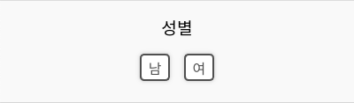

- 기간

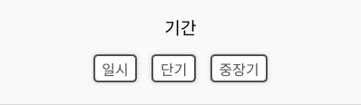

- 지역

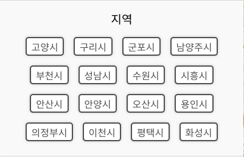

- 검색 후 지도에서 확인 하고싶은 쉼터 클릭

- 또는 좌측 필터된 쉼터 리스트 중 클릭

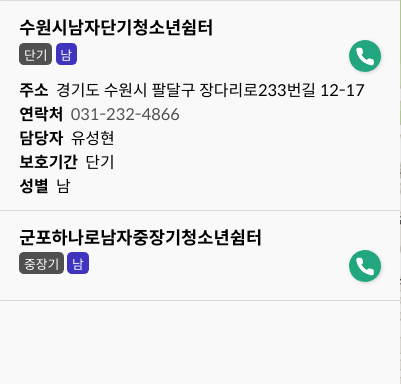

### 모바일 접속

- 모바일로 접속 하는 경우 하기와 같이 버튼 세개가 보입니다.

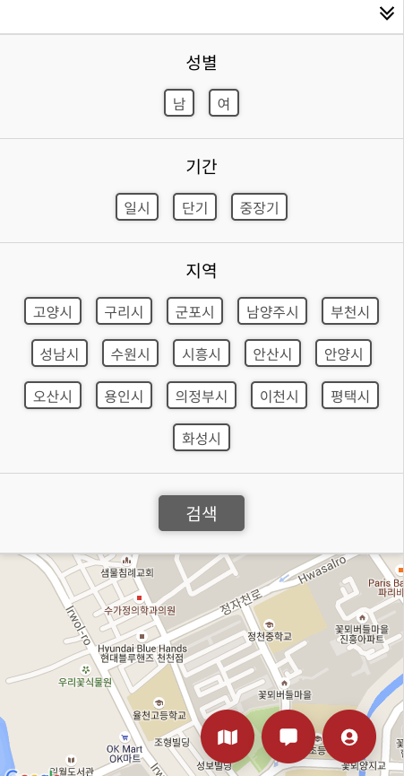

- 좌측 부터 지도 보기, 채팅 그리고 로그인 버튼 입니다.

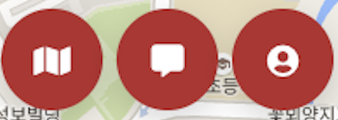

- 지도 버튼을 클릭하면 필터를 숨기고 지도만 보이게 됩니다.

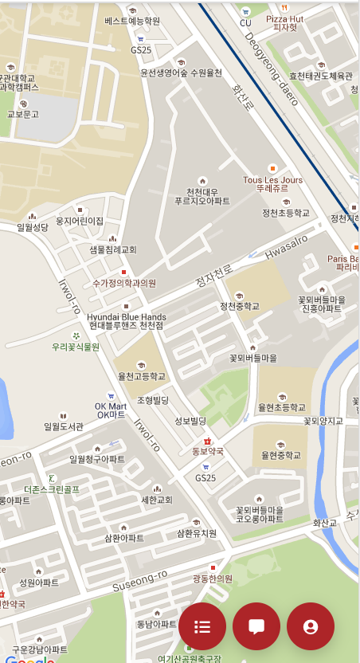

### 로그인

- 우측 하단에 있는 로그인 아이콘 클릭

- 유저 유형 선택
  - 청소년: Name, Tel 란 작성 후 

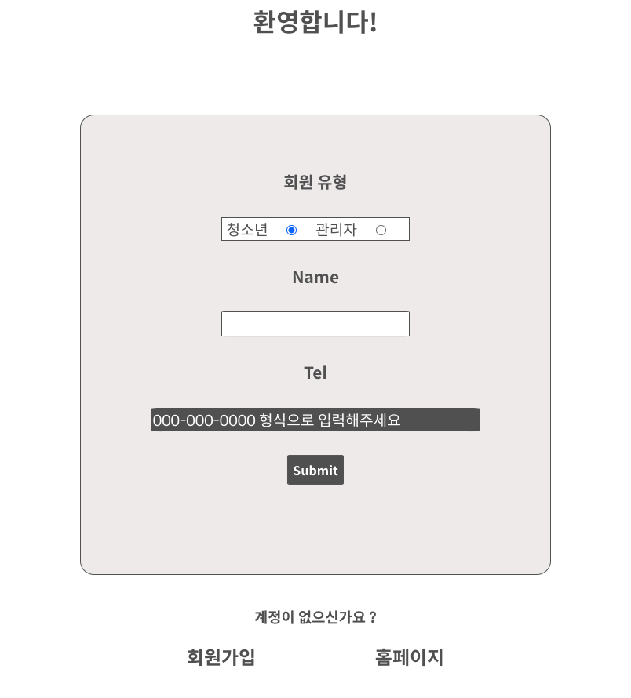

- 로그아웃 시에는 동일하게 우측 하단 버튼을 클릭

- 그 후 로그아웃 하기 클릭

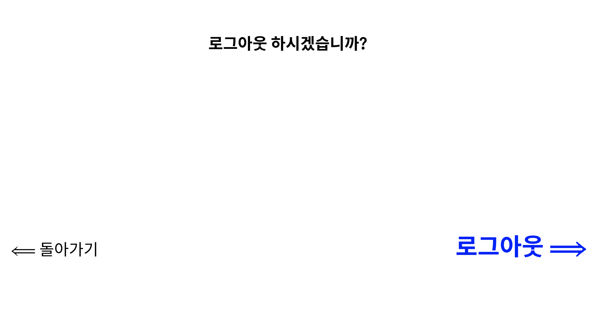

### 회원 가입

- 회원가입 페이지로 이동 후 회원 유형 선택

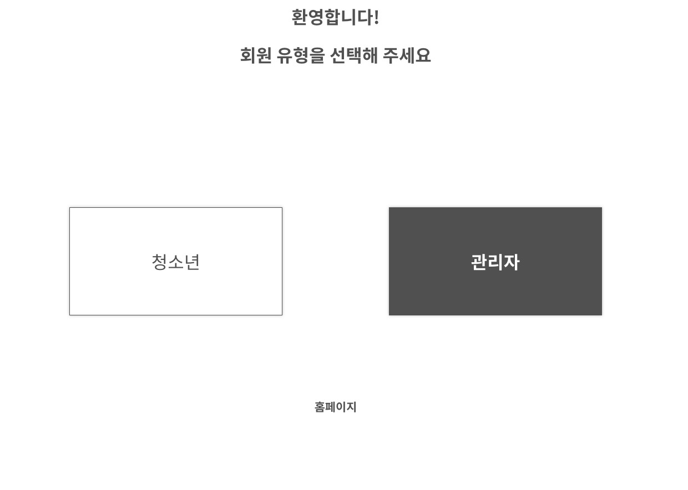

- 유형에 맞게 폼 작성 후 

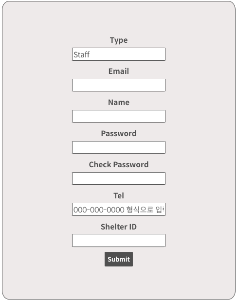

**이 외에 프로젝트 과정에서의 기획과정, 회고, 진행 현황등 자세한 사항들은 Wiki에 기록하게 됩니다. [여기](https://github.com/codestates/shelter/wiki)를 눌러 이동해 주세요**
